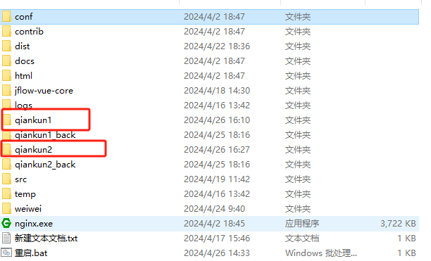

# Vue 3 + TypeScript + Vite

This template should help get you started developing with Vue 3 and TypeScript in Vite. The template uses Vue 3 `<script setup>` SFCs, check out the [script setup docs](https://v3.vuejs.org/api/sfc-script-setup.html#sfc-script-setup) to learn more.

## Recommended Setup

- [VS Code](https://code.visualstudio.com/) + [Vue - Official](https://marketplace.visualstudio.com/items?itemName=Vue.volar) (previously Volar) and disable Vetur

- Use [vue-tsc](https://github.com/vuejs/language-tools/tree/master/packages/tsc) for performing the same type checking from the command line, or for generating d.ts files for SFCs.

/partent和/app1需要根据自己的需求做改变
主应用： vite.config.ts的base加/partent   router.ts创建的时候加/partent（createWebHistory('/partent')）  router.ts里加一个匹配规则任何以/app1开头的都指向一个固定的页面用来显示子应用（这个app1可根据自己的需求配置，但改完需要同步主应用和子应用  对应的主应用改动：main.ts、每个打开子应用的入口跳转）

子应用：vite.config.ts的base加/app1，所有路由前面都加上/app1，但跟主应用不一样（path:'/parent/***'）所有跳转都正常根据router的path来跳转，这样做是为了页面刷新的时候依然停留在主应用显示子应用的页面中

nginx的配置
server {
    listen 4567;
    server_name 10.10.25.163;

    # 处理 /app1 路径子应用
    location /app1 {
        alias qiankun2;  # 确保路径以斜杠结束
        index index.html index.htm;
        try_files $uri $uri/ /index.html =404;  # 如果文件未找到，尝试 /app1/index.html
    }

    # 处理 /partent 路径主应用
    location /partent {
        alias qiankun1;  # 确保路径以斜杠结束
        index index.html index.htm;
        try_files $uri $uri/ /index.html =404;  # 如果文件未找到，尝试 /partent/index.html
    }

    # root   qiankun1;
    # index index.html index.htm;

    # location / {
    #     try_files $uri $uri/ /index.html =404;
    # }

    error_page   500 502 503 504  /50x.html;
    location = /50x.html {
        root   html;
    }
}
